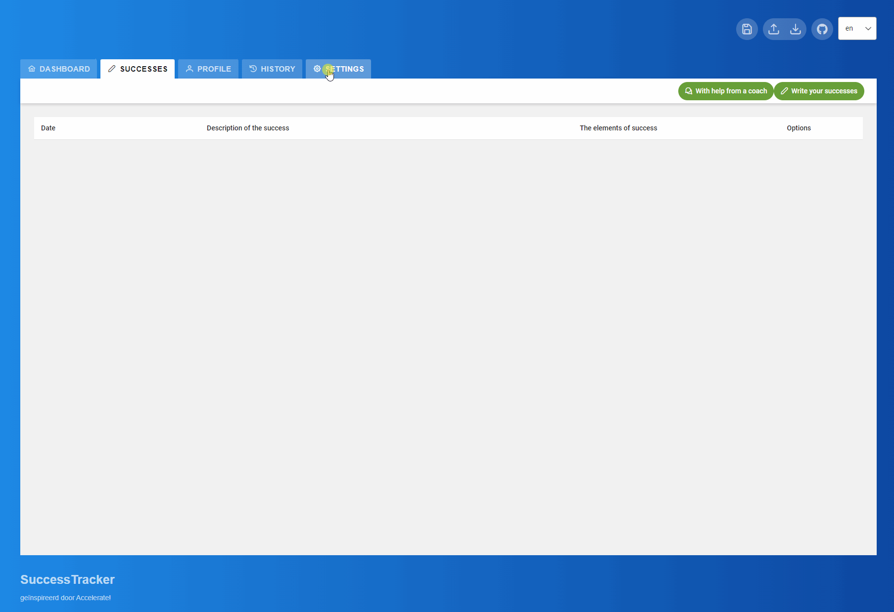

[](http://commitizen.github.io/cz-cli/)
[](https://gitpod.io/from-referrer/)
[](LICENSE)
[](https://github.com/Bengelsoft/success-tracker/actions/workflows/build_test_qa_release_deploy.yml)
[](https://bestpractices.coreinfrastructure.org/projects/7750)

# SuccessTracker
SuccessTracker: A personal success diary with an AI coach.
Recording your successes will help you boost your self-esteem and shrink your ego.

The development of SuccessTrack aims to accelerate and support personal growth. The goal is to extend the tool with support for:
- Determining goals,
- Making action plans / daily plans / weekly plans,
- keeping track of habits,
- Promoting reflection.



## Contents
- [What is SuccessTrack](#what-is-successtrack)
- [Getting started](#getting-started)
- [Documentation](#documentation)
- [Principles](#principles)
- [Local installation](#local-installation)
- [Development](#development)
  - [Install and run development mode](#install-and-run-development-mode)
  - [Faster Development with GitPod](#faster-development-with-gitpod)
  - [Playwright test](#playwright-test)
- [Contribute](#contribute)
- [Authors](#authors)
- [License](#license)

## Getting started
The latest release of the SuccessTrack application is hosted at "https://success-tracker.nl/".

## Documentation

### Features
- [Feature: Capturing Successes](docs/features/Feature_capturing_successes.md)

### Technical
- [Build and Run "Success-tracker" inside a Container](docs/Build_and_run_container_with_Podman_or_Docker.md)
- [SuccessTracker Domain](docs/SucessTracker_domain.md)
- [Using conventional commits specification for contributers](docs/Using_conventional_commits_specification_for_contributers.md)

## Principles
- Data Ownership: Users are the owners of their data, which should never be stored centrally. The application should handle privacy and sensitive information with care and refrain from unnecessary collection or storage of user data.
- Local Hosting or Deployed Version: The application should be capable of both local hosting and accessibility through a deployed version (e.g., via a web server or cloud hosting). This allows for easy and flexible distribution of the application to various users.
- Accessibility: The frontend must be accessible to users, regardless of the device they are using. The design should be responsive, with a focus on functionality across mobile devices, tablets, and computers.
- Documentation as Part of the Project: Documentation is considered an essential part of the project. It should be treated similarly to source code, with regular updates and additions. The documentation is written in Markdown and can be found in the './docs' directory of the project.
- Traceability through Automation: The project aims for traceability through automation. This includes using automated processes for version control, testing, and release building. This approach ensures project consistency and reproducibility, contributing to its stability and reliability.
- Integration with AI Provider: The project utilizes integration with an AI provider to support users. However, it's essential to note that the responsibility for the contract with the AI provider lies with the user.

## Local installation
A local version can be built by running the application build (see: [Development](#development)) or by installing a container.
See the documentation [Build and Run "Success-tracker" inside a Container](docs/Build_and_run_container_with_Podman_or_Docker.md)

## Development
For local development, the application is built with Node.js and NPM.
Requirements:
- [Node.js with npm](https://nodejs.org/)

Toegepaste Frameworks:
- [Angular](https://angular.io/)
- [PrimeNG](https://primeng.org/)
- [Playwright](https://playwright.dev/)

### Installation and Development Mode Setup:
To get started with the development of the application, follow the steps below:
1. Install the required node modules by running the following command in your terminal:

```bash
npm install --force && npm run build
```

2. Once the installation is complete, run the application in development mode using the following command:

```bash
npm run ng serve
```

### Faster Development with GitPod:

GitPod provides a comprehensive online development environment that works out-of-the-box, making development faster and more streamlined. To use GitPod for this project, simply click on the badge below:

[](https://gitpod.io/from-referrer/)

This will launch the project in a ready-to-code environment, allowing you to start developing right away without any additional setup.


### Playwright test
```bash
npx playwright test --ui
```


## Contribute
Feel free to contribute to the SuccessTrack project.

## Authors
SuccessTrack is created by Bart Engelhard.

## License
This work is licensed under 
[GNU General Public License v3.0](LICENSE)


This software utilizes the PrimeNG template named ["PRESTIGE FOR PRIMENG"](https://www.primefaces.org/layouts/prestige-ng). A "Basic License" has been acquired for this template. With this license, it is permitted to use the template exclusively for this specific application, referred to as a "Single End Product" for "Non-Commercial Usage."

For more detailed information, you can visit the official [PrimeNG layout License page](https://www.primefaces.org/layouts/licenses).
